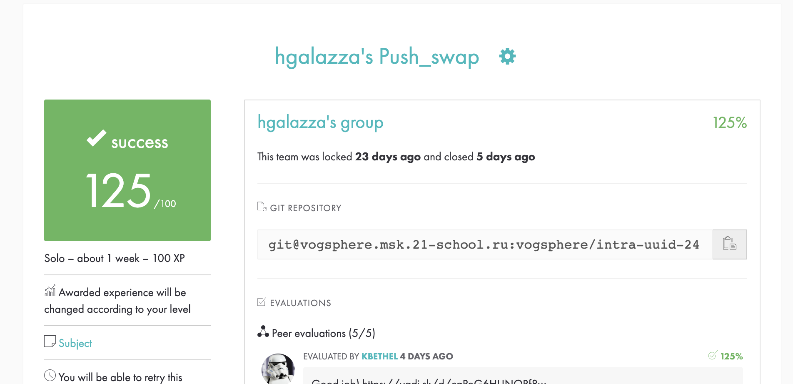

# 42 push_swap



### Challenge
This project will make you sort data on a stack, with a limited set of instructions, using
the lowest possible number of actions. To succeed you'll have to manipulate various
types of algorithms and choose the one (of many) most appropriate solution for an
optimized data sorting.
  
***
### The aim
I chose non-recursive quick-sort algorithm to sort one stack by use of another stack.

The aim of push_swap is to sort a stack of numbers using another stack in the least commands possible. The educational aim of the project was to introduce students to advanced sorting algorithms and the concept of complexity. This project earned maximum available marks for the algortihm's efficacy.

#### Commands explanation
The stacks can be rotated, have their top two elements swapped, or be pushed onto each other, the full command list is as follows:

##### Rotating commands:
```
RA - rotate stack A (send top number on stack to bottom)
RB - rotate stack B (send top number on stack to bottom)
RR - rotate both stack A and B at the same time
RRA - counter-rotate stack A (send bottom number of stack to top)
RRB - counter-rotate stack B (send bottom number of stack to top)
RRR - counter-rotate stack A and stack B at the same time
```
##### Swapping commands:
```
SA - swap top two numbers at top of stack A
SB - swap top two numbers at top of stack B
```
##### Pushing commands:
```
PA - push top element from stack A onto stack B
PB - push stack B
```
###  How to run
```console
git clone https://github.com/Radvod/push_swap
cd push_swap
make

If you want run push_swap:
ARG=`ruby -e "puts (0..100).to_a.shuffle.join(' ')"`; ./push_swap $ARG;

If you want run checker:
ARG=`ruby -e "puts (0..100).to_a.shuffle.join(' ')"`; ./push_swap $ARG | ./checker $ARG
```
###  Bonuses

I added two bonuses to this project:

**-v** flag for checker, which allows you to visualize the program's operation and show how to work with arrays step by step.

**-e** flag for both programs, which allows you to handle all input errors and fix them without causing the program to exit.
